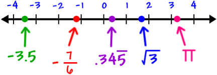

# Fundamentos de las ciencias aplicadas

## Matemáticas: números, operaciones y proporcionalidad

### Los números que usamos

Los números sirven para **contar**, **medir**, ordenar y comparar. No todos son iguales: cada grupo incluye al anterior y añade números nuevos.

- Los **números naturales** ($\mathbb{N}$) se usan para contar: 1, 2, 3, 4…
- Los **números enteros** ($\mathbb{Z}$) incluyen los naturales, el cero y los negativos: … −3, −2, −1, 0, 1, 2, 3…
- Los **números racionales** ($\mathbb{Q}$) se pueden escribir como una fracción. Por ejemplo, $\frac{1}{2} = 0{,}5$ y $\frac{3}{4} = 0{,}75$. Los decimales exactos y los periódicos son racionales.
- Los **números irracionales** tienen infinitas cifras decimales sin repetirse siguiendo un patrón. No se pueden escribir como fracción: $\pi = 3{,}14159\ldots$ o $\sqrt{3} = 1{,}73205\ldots$
- Los **números reales** ($\mathbb{R}$) reúnen todos los anteriores. Son los números que podemos colocar en una recta numérica.

::: resumen
$\mathbb{N}$ está dentro de $\mathbb{Z}$; $\mathbb{Z}$ está dentro de $\mathbb{Q}$; y los racionales e irracionales forman $\mathbb{R}$.

Cuando te pidan clasificar un número, indica el conjunto **más pequeño** al que pertenece.
:::

#### La recta numérica

En una recta numérica, los números pequeños están a la izquierda y los grandes, a la derecha. El **cero** es el origen. Los negativos quedan a su izquierda y los positivos a su derecha.

#### Actividades

1. Indica el conjunto más pequeño al que pertenece cada número: $12$; $-7$; $0{,}25$; $\frac{5}{3}$; $\pi$; $0$.
2. Ordena de menor a mayor: 3,2; −1; 0; −3,5; 3,02; 2,9.
3. Dibuja una recta numérica y sitúa: −2,5; −1; 0,75; 2; 3,5.
4. Escribe un ejemplo de número natural, entero negativo, racional e irracional.

### El sistema decimal y las operaciones

Nuestro sistema de numeración es **decimal** porque usa diez cifras: 0, 1, 2, 3, 4, 5, 6, 7, 8 y 9. También es **posicional**: una misma cifra vale cosas distintas según el lugar que ocupa.

Por ejemplo:

::: ejemplo Descomponer un número
En $51 268$, el 5 vale 50 000; el 1 vale 1 000; el 2 vale 200; el 6 vale 60 y el 8 vale 8.

$$51\,268 = 50\,000 + 1\,000 + 200 + 60 + 8$$
:::

Al sumar o restar por escrito, coloca cada cifra en su columna: unidades debajo de unidades, decenas debajo de decenas y así sucesivamente. Multiplicar equivale a sumar varias veces la misma cantidad. Dividir es repartir una cantidad en partes iguales.

En una división, el **dividendo** es la cantidad que se reparte; el **divisor**, el número de partes; el **cociente**, lo que corresponde a cada parte; y el **resto**, lo que sobra si la división no es exacta.

::: nota
Una calculadora suele mostrar decimales en vez del resto. Por ejemplo, $17 \div 5 = 3{,}4$: el cociente entero es $3$ y sobran $2$ unidades, porque $5 \times 3 + 2 = 17$
:::

#### Actividades

1. Descompón: a) 7 304; b) 42 090; c) 305 018.
2. Calcula: a) $2\,458 + 679$; b) $9\,003 - 4\,786$; c) $326 \times 7$; d) $148 \times 24$.
3. Haz las divisiones e indica el cociente y el resto: a) $96 \div 8$; b) $157 \div 6$; c) $425 \div 12$.
4. En una caja hay 144 tornillos. Se guardan en bolsas de 10. ¿Cuántas bolsas completas se llenan? ¿Cuántos tornillos sobran?

### Operaciones combinadas

Cuando una expresión tiene varias operaciones, no se puede calcular de cualquier manera. Sigue siempre este orden:

1. **Paréntesis** y corchetes.
2. **Multiplicaciones** y divisiones, de izquierda a derecha.
3. **Sumas** y restas, de izquierda a derecha.

::: ejemplo Paso a paso
Calcula $6 + 4 \times (2 + 3) - 10$.

1. Paréntesis: $6 + 4 \times 5 - 10$
2. Multiplicación: $6 + 20 - 10$
3. Suma y resta: $26 - 10 = 16$
:::

Los paréntesis cambian el orden habitual. Por eso $3 + 4 \times 2 = 11$, mientras que $(3 + 4) \times 2 = 14$.

#### Actividades

1. Calcula: a) $18 - 3 \times 4$; b) $(18 - 3) \times 4$; c) $36 \div 6 + 5 \times 3$.
2. Calcula: a) $40 + 20 \div 5 - 2$; b) $7 \times (12 - 8) + 9$; c) $48 \div (3 \times 4)$.
3. Escribe los paréntesis necesarios para que $6 + 2 \times 5$ dé como resultado $40$.

### Magnitudes y proporcionalidad

Una **magnitud** es una propiedad que se puede medir y expresar con un número y una unidad: una longitud, una masa, un tiempo o una temperatura.

Dos magnitudes son **directamente proporcionales** cuando cambian en el mismo sentido y en la misma proporción. Si se duplica una, se duplica la otra. Por ejemplo, si para 4 personas se necesitan 200 g de arroz, para 8 personas se necesitan 400 g.

| Personas | Arroz |
|---:|---:|
| 2 | 100 g |
| 4 | 200 g |
| 8 | 400 g |

Dos magnitudes son **inversamente proporcionales** cuando una aumenta y la otra disminuye en la misma proporción. Por ejemplo, para realizar el mismo trabajo, cuantos más trabajadores hay, menos tiempo se necesita.

::: ejemplo Proporcionalidad directa
3 kg de naranjas cuestan 7,50 €. ¿Cuánto cuestan 5 kg?

Primero comprobamos que más kilos implican más precio. Después:

$$ 3 \rightarrow 7,50 \\ 5 \rightarrow x \\ x = 5\times 7,50 \div 3 \\ x = 12{,}50\,\text{euros}$$
:::

::: ejemplo Proporcionalidad inversa
4 personas tardan 6 horas en limpiar un espacio. Si trabajan 8 personas al mismo ritmo, ¿cuánto tardan?

Hay el doble de personas, así que tardarán la mitad: **3 horas**. También se puede calcular: $4 \times 6 \div 8 = 3$.

$$ 4 \rightarrow 6 \\ 8 \rightarrow x \\ x = 4 \times 6 \div 8 \\ x = 3 $$

:::

#### Actividades

1. Indica si la relación es directa o inversa: a) número de cuadernos y precio; b) velocidad y tiempo para recorrer la misma distancia; c) horas trabajadas y sueldo, si se cobra por hora.
2. Para 6 bocadillos se usan 450 g de pan. ¿Cuántos gramos se necesitan para 10 bocadillos?
3. Una máquina fabrica un pedido en 12 horas. Si se usan 3 máquinas iguales trabajando a la vez, ¿cuánto tardarán?
4. Un grifo llena 80 L en 4 minutos. ¿Cuántos litros llenará en 15 minutos al mismo ritmo?

::: resumen
- Los números se clasifican en naturales, enteros, racionales, irracionales y reales.
- En el sistema decimal, el valor de una cifra depende de su posición.
- En las operaciones combinadas: paréntesis → multiplicaciones y divisiones → sumas y restas.
- En una proporcionalidad directa, las dos magnitudes aumentan o disminuyen juntas; en una inversa, una aumenta cuando la otra disminuye.
:::

## Física: magnitudes y unidades de medida

### Medir y usar el Sistema Internacional

Medir es comparar una magnitud con una unidad. El resultado de una medida siempre debe incluir **un número y una unidad**: no basta decir «mide 4»; hay que decir «mide $4\,\mathrm{m}$» o «mide $4\,\mathrm{cm}$».

Para que las medidas se entiendan en cualquier lugar se utiliza el **Sistema Internacional de Unidades (SI)**. Estas son algunas de sus magnitudes básicas:

| Magnitud | Símbolo de la magnitud | Unidad del SI | Símbolo de la unidad |
|---|---|---|---|
| Longitud | l | metro | m |
| Masa | m | kilogramo | kg |
| Tiempo | t | segundo | s |
| Temperatura | T | kelvin | K |
| Intensidad de corriente | I | amperio | A |
| Intensidad luminosa | Iv | candela | cd |
| Cantidad de sustancia | n | mol | mol |

::: nota Masa y peso no son lo mismo
La **masa** indica la cantidad de materia de un cuerpo y se mide en kilogramos. El **peso** es una fuerza: depende de la gravedad y se mide en newtons (N).
:::

Para evitar números enormes o diminutos se usan prefijos. Los más habituales son kilo- ($\mathrm{k}$, mil veces), hecto- ($\mathrm{h}$, cien veces), deca- ($\mathrm{da}$, diez veces), deci- ($\mathrm{d}$, una décima), centi- ($\mathrm{c}$, una centésima) y mili- ($\mathrm{m}$, una milésima).

#### Actividades

1. Indica la magnitud y una unidad adecuada para medir: a) la duración de una carrera; b) la masa de una mochila; c) la temperatura de una habitación.
2. Completa: a) 1 km = ___ m; b) 1 m = ___ cm; c) 1 kg = ___ g; d) 1 mL = ___ L.
3. Corrige estas medidas incompletas: «La mesa mide 120»; «La botella contiene 1,5».
4. ¿Qué unidad elegirías para el grosor de una moneda: km, m, cm o mm? Justifica tu respuesta.

### Longitud y cambios de unidad

La **longitud** expresa la distancia entre dos puntos. La unidad del SI es el metro (m), pero elegimos múltiplos y submúltiplos según el tamaño de lo que medimos.

| km | hm | dam | m | dm | cm | mm |
|---:|---:|---:|---:|---:|---:|---:|
| / 10 | / 10 | / 10 | 1 | × 10 | × 10 | × 10 |

Al avanzar una casilla hacia la derecha, multiplicamos por 10. Al avanzar hacia la izquierda, dividimos por 10. Con decimales, esto equivale a desplazar la coma una posición por cada salto.

::: ejemplo Dos conversiones
$$2{,}5\,\mathrm{km} = 2\,500\,\mathrm{m}$$

De $\mathrm{km}$ a $\mathrm{m}$ hay tres saltos a la derecha.

$$384\,\mathrm{cm} = 3{,}84\,\mathrm{m}$$

De $\mathrm{cm}$ a $\mathrm{m}$ hay dos saltos a la izquierda.
:::

Antes de calcular, escribe la equivalencia que vas a usar y revisa si el resultado tiene sentido. Una puerta no puede medir $2\,000\,\mathrm{m}$: seguramente mide $2\,000\,\mathrm{mm}$ o $2\,\mathrm{m}$.

#### Actividades

1. Convierte: a) 4,7 km a m; b) 325 cm a m; c) 0,86 m a mm; d) 12 500 mm a m.
2. Convierte: a) 3,45 hm a cm; b) 68 dm a m; c) 0,009 km a m.
3. El largo de una mesa es 1,20 m y su ancho 65 cm. Expresa las dos medidas en centímetros.
4. Elige una unidad razonable para: a) la distancia entre dos ciudades; b) el ancho de un cuaderno; c) el diámetro de un cable fino.

### Volumen y capacidad

El **volumen** es el espacio que ocupa un cuerpo. En el SI se mide en metros cúbicos ($\mathrm{m}^{3}$). La **capacidad** indica cuánto puede contener un recipiente. Para la vida diaria se usa mucho el litro ($\mathrm{L}$), una unidad aceptada junto al SI.

Un litro equivale al volumen de un cubo de un decímetro de lado:

::: formula
$$1\,\mathrm{L} = 1\,\mathrm{dm}^{3}$$
:::

En capacidad usamos una escalera parecida a la de longitud:

| kL | hL | daL | L | dL | cL | mL |
|---:|---:|---:|---:|---:|---:|---:|
| / 10 | / 10 | / 10 | 1  | × 10 | × 10 | × 10 |

::: ejemplo Cambiar de unidad de capacidad
$$6{,}3\,\mathrm{L} = 630\,\mathrm{cL}$$

De $\mathrm{L}$ a $\mathrm{cL}$ hay dos saltos a la derecha.

$$4\,835\,\mathrm{mL} = 4{,}835\,\mathrm{L}$$

De $\mathrm{mL}$ a $\mathrm{L}$ hay tres saltos a la izquierda.
:::

No confundas volumen y capacidad: una piscina ocupa un volumen, mientras que también decimos que tiene una capacidad determinada de agua. En ambos casos se usan unidades relacionadas, pero describen ideas distintas.

#### Actividades

1. Convierte: a) 3,5 L a mL; b) 850 mL a L; c) 2,4 kL a L; d) 75 cL a L.
2. Una botella contiene 1,5 L de agua. ¿Cuántos vasos de 250 mL se pueden llenar por completo?
3. Indica la unidad más adecuada: a) la dosis de un jarabe; b) el contenido de una lata; c) el agua de una piscina.
4. Explica con tus palabras la diferencia entre volumen y capacidad.

::: resumen
- Una medida se expresa con un número y una unidad.
- El SI fija unidades comunes para las magnitudes físicas.
- En las conversiones entre unidades consecutivas se multiplica o divide por 10.
- La unidad de longitud es el metro; la del volumen es el metro cúbico; el litro se usa habitualmente para expresar capacidad.
:::

## Práctica digital: seguridad y material de laboratorio

En esta práctica elaborarás en el ordenador un documento de consulta sobre el laboratorio. Puedes utilizar Google Docs. Busca la información en fuentes fiables y redacta con tus propias palabras; no copies y pegues textos sin revisarlos.

### Formato de entrega

En la primera parte del documento deben aparecer estos datos:

- **Título:** *Seguridad y material básico de laboratorio*.
- **Autor o autora:** tu nombre y apellidos.
- **Fecha:** día de entrega.
- **Asignatura:** Ciencias Aplicadas I.

Organiza el resto del trabajo con títulos claros y cuida la ortografía y la presentación; es fundamental.

### Contenido obligatorio

Tu documento debe incluir los cuatro apartados siguientes:

1. **Normas básicas de laboratorio.** Escribe al menos ocho normas para trabajar antes, durante y después de una práctica. Incluye normas sobre la protección personal, el orden de la mesa, la lectura de etiquetas, la prohibición de comer o beber, la comunicación de accidentes y la recogida de residuos.
2. **Pictogramas de peligro.** Añade los pictogramas que se utilizan para reconocer los principales peligros químicos. Junto a cada uno escribe su nombre y explica brevemente qué riesgo avisa. Incluye, como mínimo: explosivo, inflamable, comburente, gas a presión, corrosivo, tóxico, peligro grave para la salud, irritante o nocivo y peligroso para el medio ambiente.
3. **Materiales comunes de laboratorio.** Explica para qué sirven los materiales básicos: vaso de precipitados, matraz de Erlenmeyer, tubo de ensayo, probeta, pipeta, embudo, vidrio de reloj, varilla agitadora y placa de Petri. Añade un dibujo de cada material. Puedes realizar los dibujos con una herramienta digital o insertarlos si indicas de dónde proceden.
4. **Material de sujeción y calentamiento.** Describe y añade un dibujo material básico que permite sujetar o calentar con seguridad: gradilla, soporte universal, pinzas, trípode, rejilla, pinzas de madera y mechero de laboratorio. Añade también una norma de seguridad relacionada con el calentamiento: no se calientan recipientes cerrados y la boca de un tubo de ensayo nunca se dirige hacia una persona.

### Antes de entregar

Comprueba que el documento contiene los cuatro datos iniciales, los cuatro apartados obligatorios, los nombres de los pictogramas y los dibujos de todo el material solicitado.

## Actividades de repaso

### Matemáticas

1. Indica el conjunto más pequeño al que pertenece cada número: a) $-15$; b) $8$; c) $0{,}125$; d) $\sqrt{3}$; e) $0$.
2. Ordena de menor a mayor: $4{,}05$; $-2$; $0$; $4{,}5$; $-2{,}7$; $3{,}99$.
3. Descompón el número 608 047 según el valor de sus cifras.
4. Calcula: a) $3\,457 + 896$; b) $8\,000 - 3\,764$; c) $245 \times 16$; d) $385 \div 7$. En la división, indica cociente y resto.
5. Resuelve respetando la jerarquía: a) $12 + 4 \times 3$; b) $(12 + 4) \times 3$; c) $48 \div 6 + 7 \times 2$; d) $50 - (8 + 2) \times 4$.
6. Para hacer 5 batidos se necesitan 750 mL de leche. ¿Cuántos mililitros se necesitan para 8 batidos?
7. Se tardan 9 horas en revisar un almacén con 2 personas. Si trabajan 6 personas al mismo ritmo, ¿cuánto tiempo tardarán? Indica si la proporcionalidad es directa o inversa.

::: nota
En los problemas, escribe los datos, la operación y una respuesta final con unidad.
:::

### Física: unidades y conversiones

1. Indica la unidad más adecuada para medir: a) la longitud de una carretera; b) el grosor de un folio; c) la masa de una persona; d) el tiempo de una película.
2. Convierte: a) 6,25 km a m; b) 0,45 m a cm; c) 3 750 mm a m; d) 2,8 hm a dm.
3. Un pasillo mide 18,6 m. Exprésalo en centímetros y milímetros.
4. Convierte: a) 2,75 L a mL; b) 1 250 mL a L; c) 4,5 kL a L; d) 36 cL a mL.
5. Una garrafa tiene 5 L de agua. ¿Cuántas botellas de 330 mL se pueden llenar por completo? ¿Cuánta agua sobra?
6. Explica la diferencia entre masa y peso.
7. Una medida aparece escrita como «250». Escribe dos preguntas que necesitarías hacer antes de interpretar ese dato.

::: resumen Antes de entregar
Revisa que has contestado a todo, que las operaciones están visibles y que cada medida incluye su unidad. En la práctica digital, comprueba que has incluido todos los apartados y los dibujos solicitados.
:::
