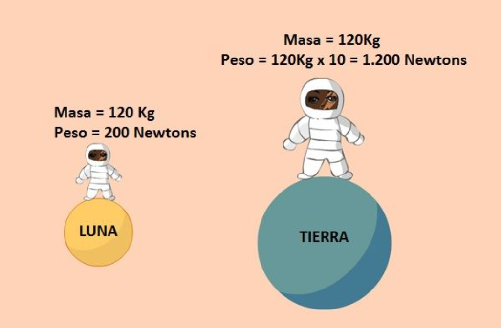
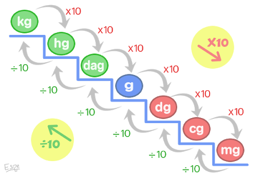
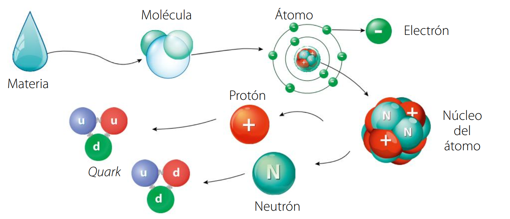
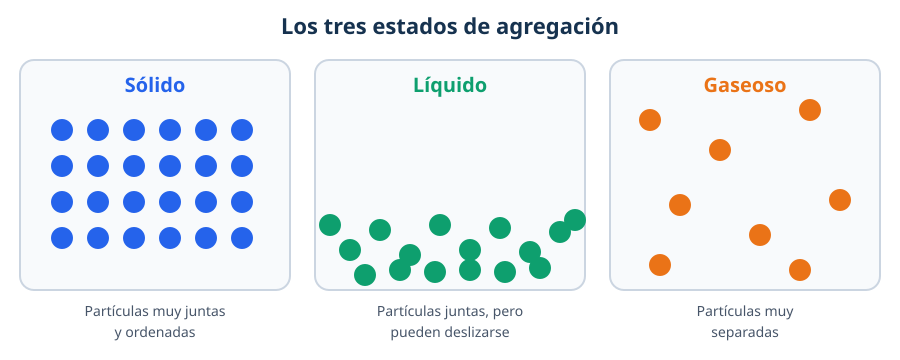
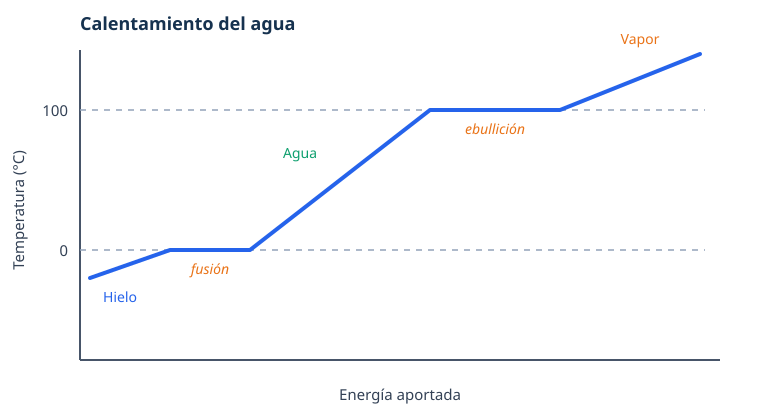

# Combinar la materia

## ¿Qué vamos a aprender?

En este tema trabajaremos tres bloques que están conectados:

- **Matemáticas:** las potencias y sus propiedades.
- **Física y química:** la masa y sus unidades, las propiedades de la materia y los estados de agregación.
- **Biología:** la materia viva, la célula y la función de relación.

::: resumen Lo esencial
Al terminar el tema deberías ser capaz de:

- Escribir y calcular potencias, y usar sus propiedades básicas.
- Cambiar unidades de masa y usar la relación $1\,\mathrm{kg} = 1\,\mathrm{L} = 1\,\mathrm{dm}^3$ para el agua.
- Calcular una densidad con $d = m/V$.
- Explicar los tres estados de agregación y los cambios de estado.
- Distinguir bioelementos y biomoléculas, y ordenar los niveles de organización de la materia viva.
- Explicar cómo funcionan la función de relación y los sentidos.
:::

## Matemáticas: potencias

### ¿Qué es una potencia?

Una **potencia** es una forma abreviada de escribir un producto en el que se repite el mismo número:

::: formula
$$a^n = \underbrace{a \times a \times \cdots \times a}_{n\ \text{veces}}$$
:::

- La **base** ($a$) es el número que se multiplica.
- El **exponente** ($n$) indica cuántas veces se multiplica la base.

::: ejemplo Leer y calcular potencias
$$5^4 = 5 \times 5 \times 5 \times 5 = 625$$

- $5^4$ se lee «cinco elevado a cuatro» o «cinco a la cuarta».
- $4^2$ se lee «cuatro al cuadrado» y $4^3$ se lee «cuatro al cubo».
:::

Para calcular potencias con la calculadora se usa la tecla $x^y$: se escribe la base, se pulsa $x^y$, se escribe el exponente y se pulsa «=».

#### Actividades

1. Indica la base y el exponente: a) $7^3$; b) $2^{10}$; c) $12^2$; d) $9^1$.
2. Escribe como potencia: a) $3 \times 3 \times 3 \times 3$; b) $5 \times 5$; c) $7 \times 7 \times 7 \times 7 \times 7$.
3. Calcula: a) $2^4$; b) $4^3$; c) $6^2$; d) $10^5$.
4. ¿Cómo se leen? a) $8^3$; b) $15^2$; c) $2^6$.

::: temporizador 4 min
En vuestro cuaderno, resolvemos los tres primeros ejercicios, escribiendo las operaciones. Luego, corregimos con la persona de al lado.
:::

### Potencias de base 10

Una potencia de base 10 es igual a la **unidad seguida de tantos ceros como indica el exponente**:

| Potencia | Desarrollo | Resultado |
|---|---|---|
| $10^0$ | — | $1$ |
| $10^1$ | $10$ | $10$ |
| $10^2$ | $10 \times 10$ | $100$ |
| $10^3$ | $10 \times 10 \times 10$ | $1\,000$ |
| $10^6$ | $10 \times 10 \times 10 \times 10 \times 10 \times 10$ | $1\,000\,000$ |

Las potencias de base 10 sirven para escribir **números grandes** de forma corta:

::: ejemplo Descomponer un número
$$24\,598 = 2 \times 10^4 + 4 \times 10^3 + 5 \times 10^2 + 9 \times 10^1 + 8$$

$$2\,000\,000 = 2 \times 1\,000\,000 = 2 \times 10^6$$
:::

Esto se llama **descomposición polinómica** y se usa mucho en ciencias para escribir medidas muy grandes o muy pequeñas.

#### Actividades

1. Escribe con números: a) $10^3$; b) $10^5$; c) $10^7$.
2. Escribe como potencia de 10: a) 100; b) 10 000; c) 1 000 000.
3. Completa: a) $3\,000 = 3 \times 10^{?}$; b) $45\,000 = 4{,}5 \times 10^{?}$.
4. Descompón el número 67 304 como suma de potencias de 10.

::: temporizador 4 min
En vuestro cuaderno, resolvemos los ejercicios 2, 3 y 4.
:::

### Las propiedades de las potencias

No siempre hace falta calcular el resultado: podemos dejar el resultado **como una sola potencia**. Estas son las propiedades que más se usan:

| Propiedad | Se escribe | Ejemplo |
|---|---|---|
| Potencia de un producto | $(a \times b)^n = a^n \times b^n$ | $(5 \times 4)^2 = 5^2 \times 4^2$ |
| Potencia de un cociente | $(a : b)^n = a^n : b^n$ | $(12 : 4)^3 = 12^3 : 4^3$ |
| Potencia de una potencia | $(a^m)^n = a^{m \times n}$ | $(5^4)^2 = 5^8$ |
| Producto de potencias de la misma base | $a^m \times a^n = a^{m+n}$ | $3^6 \times 3^5 = 3^{11}$ |
| Cociente de potencias de la misma base | $a^m : a^n = a^{m-n}$ | $12^5 : 12^3 = 12^2$ |
| Exponente cero | $a^0 = 1$ | $7^0 = 1$ |

::: importante
En las tres primeras propiedades el exponente es **común** y afecta a los dos números. En las dos siguientes la **base es común** y los exponentes se suman o se restan.
:::

#### Actividades

1. Escribe como una sola potencia: a) $2^3 \times 2^4$; b) $5^7 : 5^2$; c) $(3^2)^4$; d) $9^0$.
2. Aplica la propiedad y calcula: a) $(2 \times 5)^3$; b) $(20 : 4)^2$; c) $10^4 \times 10^2$; d) $7^5 : 7^3$.
3. ¿Verdadero o falso? Corrige los enunciados falsos: a) $2^4 \times 2^5 = 2^{20}$; b) $6^7 : 6^7 = 1$; c) $(10^5)^2 = 10^7$; d) $3^0 = 1$.

::: temporizador 6 min
Resolved individualmente las actividades 1 y 2. Cuando acabe el tiempo, corregimos en la pizarra entre todos.
:::

::: resumen
- Una potencia es una multiplicación repetida: $a^n$.
- Las potencias de base 10 permiten escribir números grandes terminados en ceros.
- Las propiedades nos dejan escribir el resultado **como una sola potencia**.
:::

#### Practica online

- <a href="https://www.cokitos.com/ecuaciones-con-potencias/play/" target="_blank" rel="noopener">Carrera de potencias (Arcademics)</a>

> Los enlaces se abren en el navegador. Si no hay conexión, las actividades del cuaderno son suficientes.

## Física y química: la masa y sus unidades

### Masa y peso no son lo mismo

La **masa** mide la cantidad de materia de un cuerpo. Su unidad en el Sistema Internacional es el **kilogramo** ($\mathrm{kg}$), aunque en el día a día usamos mucho el **gramo** ($\mathrm{g}$).

El **peso** es la fuerza con la que la gravedad atrae a un cuerpo y se mide en **newtons** ($\mathrm{N}$). Un mismo cuerpo tiene la misma masa en la Tierra y en la Luna, pero pesa distinto.

::: ejemplo
Un objeto de $6{,}13\,\mathrm{kg}$ pesa unos $60\,\mathrm{N}$ en la Tierra, unos $9{,}9\,\mathrm{N}$ en la Luna y unos $152\,\mathrm{N}$ en Júpiter. Su masa no cambia: siempre es $6{,}13\,\mathrm{kg}$.
:::

#### Actividades

1. Di si es una medida de masa o de peso: a) $70\,\mathrm{kg}$; b) $700\,\mathrm{N}$; c) $250\,\mathrm{g}$; d) $9{,}8\,\mathrm{N}$.
2. ¿Por qué un astronauta pesa menos en la Luna pero su masa es la misma?
3. Pon tres ejemplos de objetos que midas en gramos y tres que midas en kilogramos.

### Cambio de unidades de masa

Para pasar de una unidad a otra multiplicamos o dividimos por 10 en cada salto:

::: ejemplo Dos conversiones
$$3{,}25\,\mathrm{kg} = 3\,250\,\mathrm{g} \qquad \text{(tres saltos a la derecha)}$$

$$2\,415\,\mathrm{mg} = 2{,}415\,\mathrm{g} \qquad \text{(tres saltos a la izquierda)}$$
:::

Existen otras unidades de masa:

- La **tonelada** ($\mathrm{t}$) equivale a $1\,000\,\mathrm{kg}$.
- El **quintal** ($\mathrm{q}$) equivale a $100\,\mathrm{kg}$.

#### Actividades

1. Copia y completa: a) $1\,\mathrm{kg} = \_\_\_\,\mathrm{g}$; b) $1\,\mathrm{g} = \_\_\_\,\mathrm{mg}$; c) $1\,\mathrm{t} = \_\_\_\,\mathrm{kg}$; d) $1\,\mathrm{q} = \_\_\_\,\mathrm{kg}$.
2. Convierte: a) $2{,}5\,\mathrm{kg} \to \mathrm{g}$; b) $3\,500\,\mathrm{g} \to \mathrm{kg}$; c) $4{,}2\,\mathrm{g} \to \mathrm{mg}$; d) $850\,\mathrm{mg} \to \mathrm{g}$.
3. Expresa en kilogramos: a) $250\,\mathrm{g}$; b) $1{,}5\,\mathrm{t}$; c) $3\,\mathrm{q}$; d) $12\,000\,\mathrm{g}$.
4. Una vaca lechera tiene una masa de 5 quintales. ¿Cuántos kilogramos son?

::: temporizador 5 min
En parejas, resolved las actividades 2 y 3. Recordad escribir siempre el resultado con su unidad.
:::

### La relación entre masa, capacidad y volumen

Para el **agua pura** existe una relación muy útil entre estas tres magnitudes:

| Masa | Capacidad | Volumen |
|---|---|---|
| $1\,\mathrm{t}$ | $1\,\mathrm{kL}$ | $1\,\mathrm{m}^3$ |
| $1\,\mathrm{kg}$ | $1\,\mathrm{L}$ | $1\,\mathrm{dm}^3$ |
| $1\,\mathrm{g}$ | $1\,\mathrm{mL}$ | $1\,\mathrm{cm}^3$ |

Por eso decimos que $1\,\mathrm{L}$ de agua tiene una masa de $1\,\mathrm{kg}$, y que $1\,\mathrm{m}^3$ de agua tiene una masa de $1$ tonelada.

#### Actividades

1. Completa: a) $6\,\mathrm{L}$ de agua tiene una masa de $\_\_\_\,\mathrm{kg}$; b) $250\,\mathrm{mL}$ de agua tienen una masa de $\_\_\_\,\mathrm{g}$; c) $0.5\,\mathrm{m}^3$ de agua tiene una masa de $\_\_\_\,\mathrm{t}$.
2. Una garrafa contiene $5\,\mathrm{L}$ de agua. ¿Cuál es su masa en kilogramos?
3. Un depósito tiene $2\,\mathrm{m}^3$ de agua. ¿Cuántos litros son? ¿Cuántas toneladas son?

::: temporizador 4 min
Resolved individualmente las actividades 2 y 3. Cuando acabe el tiempo, corregimos en la pizarra entre todos.
:::

::: resumen
- La masa mide la cantidad de materia ($\mathrm{kg}$, $\mathrm{g}$); el peso es una fuerza ($\mathrm{N}$).
- Para cambiar de unidad de masa multiplicamos o dividimos por 10 en cada salto.
- $1\,\mathrm{t} = 1\,000\,\mathrm{kg}$ y $1\,\mathrm{q} = 100\,\mathrm{kg}$.
- Para el agua: $1\,\mathrm{kg} = 1\,\mathrm{L} = 1\,\mathrm{dm}^3$.
:::

## Física y química: la materia y sus propiedades

### ¿Qué es la materia?

La **materia** es todo lo que ocupa un lugar en el espacio y tiene masa. Un **sistema material** es una porción de materia que estudiamos (un trozo de pan, una piedra, el aire de una botella). Todo lo que rodea al sistema es el **entorno** o ambiente.

La materia está formada por partículas cada vez más pequeñas, que se organizan por **niveles**:

1. **Nivel subatómico:** los *quarks* forman protones y neutrones.
2. **Nivel atómico:** el núcleo (protones y neutrones) y los electrones forman los **átomos**.
3. **Nivel molecular:** los átomos se unen y forman **moléculas** (agua, oxígeno, dióxido de carbono…).

#### Actividades

Encuentra los distintos niveles que hemos visto en esta gráfica <a href="https://scaleofuniverse.com/es-es" target="_blank" rel="noopener">La escala del universo</a>

### Propiedades generales: masa y volumen

Las propiedades **generales** son comunes a toda la materia:

- La **masa**, que ya hemos estudiado.
- El **volumen**, que es el espacio que ocupa un cuerpo. Se mide en $\mathrm{m}^3$ o en $\mathrm{cm}^3$.

El volumen de una caja se calcula multiplicando sus tres dimensiones:

::: formula
$$V = \text{alto} \times \text{ancho} \times \text{largo}$$
:::

::: ejemplo Dos cajas con el mismo volumen
Una caja de $6 \times 6 \times 6\,\mathrm{cm}$: $V = 216\,\mathrm{cm}^3$.

Otra caja de $4{,}5 \times 6 \times 8\,\mathrm{cm}$: $V = 216\,\mathrm{cm}^3$.

Tienen formas distintas, pero el mismo volumen.
:::

La **capacidad** es la cantidad de materia que puede contener un recipiente. Un depósito hueco de $1\,\mathrm{m}^3$ tiene capacidad para $1\,000\,\mathrm{L}$.

#### Actividades

1. Calcula el volumen de una caja de $5\,\mathrm{cm} \times 4\,\mathrm{cm} \times 3\,\mathrm{cm}$.
2. ¿Qué caja ocupa más: una de $10 \times 2 \times 2\,\mathrm{cm}$ o una de $4 \times 4 \times 4\,\mathrm{cm}$?
3. ¿Pueden dos cuerpos tener el mismo volumen y masas distintas? Explícalo con un ejemplo.

### Propiedades específicas: la densidad

Las propiedades **específicas** son características de cada sustancia: el color, el olor, el sabor, el punto de fusión o la densidad.

La **densidad** ($d$) relaciona la masa de un cuerpo con el volumen que ocupa:

::: formula
$$d = \frac{m}{V}$$
:::

Se mide en $\mathrm{kg/m}^3$ o, en el laboratorio, en $\mathrm{g/cm}^3$ (que es lo mismo que $\mathrm{g/mL}$).

::: ejemplo Densidad del oro
Un anillo de oro tiene una masa de $40\,\mathrm{g}$ y ocupa un volumen de $2{,}07\,\mathrm{mL}$. ¿Cuál es su densidad?

$$d = \frac{m}{V} = \frac{40\,\mathrm{g}}{2{,}07\,\mathrm{mL}} \approx 19{,}3\,\mathrm{g/mL}$$
:::

Un cuerpo **flota** en el agua si su densidad es **menor** que $1\,\mathrm{g/cm}^3$, y se **hunde** si es mayor. Por eso el corcho flota y el hierro se hunde.

#### Actividades

1. ¿Qué volumen ocupan $250\,\mathrm{g}$ de mercurio? ($d_{\text{mercurio}} = 13{,}6\,\mathrm{g/mL}$)
2. ¿Qué masa tienen $125\,\mathrm{mL}$ de mercurio?
3. Un trozo de corcho tiene una masa de $12\,\mathrm{g}$ y un volumen de $50\,\mathrm{cm}^3$. Calcula su densidad. ¿Flotará en el agua?
4. Ordena de menor a mayor densidad estas sustancias: corcho, agua, hierro y aceite.

::: temporizador 6 min
Resolved las actividades 1 y 2. Escribid la fórmula, sustituid los datos y expresad el resultado con su unidad.
:::

### Temperatura, calor y presión

- La **temperatura** mide la energía térmica de las partículas. En el Sistema Internacional se mide en **kelvin** ($\mathrm{K}$), aunque usamos los **grados Celsius** ($^\circ\mathrm{C}$).

::: formula
$$T(\mathrm{K}) = 273 + T(^\circ\mathrm{C})$$
:::

- El **calor** es la energía que pasa de un cuerpo caliente a otro más frío. Se mide en **julios** ($\mathrm{J}$) o en **calorías** ($\mathrm{cal}$).
- La **presión** mide la fuerza que ejerce un cuerpo sobre una superficie. Se mide en **pascales** ($\mathrm{Pa}$) o en **atmósferas** ($\mathrm{atm}$).

::: dato
$1\,\mathrm{cal} = 4{,}18\,\mathrm{J}$ y $1\,\mathrm{atm} = 101\,300\,\mathrm{Pa}$. Cuando calentamos un gas en un recipiente cerrado, aumentan la temperatura y la presión.
:::

#### Actividades

1. Transforma: a) $298\,\mathrm{K} \to {}^\circ\mathrm{C}$; b) $0\,\mathrm{K} \to {}^\circ\mathrm{C}$; c) $25^\circ\mathrm{C} \to \mathrm{K}$; d) $85^\circ\mathrm{C} \to \mathrm{K}$.
2. Una hamburguesa aporta $86\,\mathrm{kJ}$. ¿Cuántas kilocalorías son? ($1\,\mathrm{kcal} = 4{,}18\,\mathrm{kJ}$)
3. ¿Qué indica la temperatura de un cuerpo? ¿Y el calor?

::: resumen
- La materia ocupa un espacio y tiene masa; está formada por partículas organizadas en niveles.
- Las propiedades generales (masa, volumen) son comunes a toda la materia; las específicas (densidad, color, punto de fusión…) identifican cada sustancia.
- La densidad se calcula con $d = m / V$.
- La temperatura se mide en $^\circ\mathrm{C}$ o $\mathrm{K}$; el calor, en $\mathrm{J}$ o $\mathrm{cal}$.
:::

#### Practica online

Simulación **«Densidad»** de PhET: <a href="https://phet.colorado.edu/es/simulations/density" target="_blank" rel="noopener">phet.colorado.edu/es/simulations/density</a>

Puedes cambiar la masa y el volumen de un bloque y comprobar cuándo flota o se hunde en el agua.

## Física y química: los estados de la materia

### Los estados de agregación

Según cómo estén unidas y separadas sus partículas, la materia se encuentra en distintos estados:

| Estado | Partículas | Forma y volumen | ¿Fluye? |
|---|---|---|---|
| **Sólido** | Muy juntas y ordenadas | Fijos | No |
| **Líquido** | Juntas, pero pueden deslizarse | Volumen fijo; adopta la forma del recipiente | Sí |
| **Gaseoso** | Muy separadas | Ocupa todo el recipiente | Sí |

Existe un cuarto estado, el **plasma**, que se forma al calentar mucho un gas: los átomos pierden electrones y se convierten en iones. Es el estado más abundante del universo: las estrellas, los rayos y las auroras contienen plasma.

#### Actividades

1. Indica en qué estado está: a) el hielo; b) el aceite; c) el vapor de agua; d) una piedra.
2. ¿Por qué un gas ocupa todo el recipiente y un sólido no?
3. Explica con tus palabras por qué los gases se pueden comprimir y los líquidos casi no.
4. ¿Dónde encontramos plasma en la naturaleza? Cita dos ejemplos.

::: temporizador 4 min
En parejas, resolved las actividades 1 y 2 y explicad las respuestas usando el modelo de partículas.
:::

### Los cambios de estado

Cuando cambia la temperatura, la materia pasa de un estado a otro. Son **cambios físicos**: la sustancia sigue siendo la misma.

| Cambio | De… a… |
|---|---|
| **Fusión** | Sólido → líquido |
| **Solidificación** | Líquido → sólido |
| **Vaporización** | Líquido → gas |
| **Condensación** | Gas → líquido |
| **Sublimación** | Sólido → gas |
| **Sublimación inversa** | Gas → sólido |

Al calentar, las partículas se mueven más deprisa y se separan; al enfriar, pierden energía y se acercan. El cambio de estado no es inmediato: mientras dura, la temperatura se mantiene constante.

#### Actividades

1. Nombra el cambio de estado: a) hielo → agua; b) agua → vapor; c) vapor → agua líquida; d) agua → hielo.
2. Al sacar un helado del congelador aparece «niebla» a su alrededor. ¿Qué cambio de estado ocurre?
3. En la gráfica del agua, ¿qué está pasando mientras la temperatura se mantiene en $0^\circ\mathrm{C}$? ¿Y en $100^\circ\mathrm{C}$?
4. Copia y completa: «Al aumentar la temperatura, las partículas se mueven ________ y la sustancia pasa de ________ a ________».

::: temporizador 5 min
Resolved las actividades 1 y 3. Para la actividad 3, mirad la gráfica y explicad qué ocurre en cada tramo plano.
:::

### Puntos de fusión y ebullición

Cada **sustancia pura** tiene un punto de fusión y un punto de ebullición característicos. Sirven para identificarla y para saber si una sustancia es pura.

| Sustancia | Punto de fusión | Punto de ebullición |
|---|---|---|
| Agua | $0^\circ\mathrm{C}$ | $100^\circ\mathrm{C}$ |
| Oro | $1\,064^\circ\mathrm{C}$ | $2\,700^\circ\mathrm{C}$ |
| Cobre | $1\,085^\circ\mathrm{C}$ | $2\,562^\circ\mathrm{C}$ |
| Cuarzo | $1\,713^\circ\mathrm{C}$ | $2\,230^\circ\mathrm{C}$ |

::: dato
El agua pura, al nivel del mar, congela a $0^\circ\mathrm{C}$ y hierve a $100^\circ\mathrm{C}$. Los anticongelantes de los coches congelan por debajo de $0^\circ\mathrm{C}$ y hierven por encima de $100^\circ\mathrm{C}$ porque no son agua pura.
:::

#### Actividades

1. ¿A qué temperatura se funde el oro? ¿Y a qué temperatura hierve?
2. Ordena de menor a mayor punto de fusión: agua, cuarzo, cobre y oro.
3. Una sustancia desconocida funde a $0^\circ\mathrm{C}$ y hierve a $100^\circ\mathrm{C}$. ¿Qué sustancia crees que es?
4. ¿Qué diferencia hay entre ebullición y evaporación? (Pista: piensa en lo que ocurre en un charco.)

::: resumen
- Los estados de agregación son sólido, líquido, gaseoso y plasma.
- Los cambios de estado son cambios físicos: fusión, solidificación, vaporización, condensación, sublimación y sublimación inversa.
- Cada sustancia pura tiene unos puntos de fusión y de ebullición característicos.
:::

#### Practica online

Simulación **«Estados de la materia: básico»** de PhET: <a href="https://phet.colorado.edu/es/simulations/states-of-matter-basics" target="_blank" rel="noopener">phet.colorado.edu/es/simulations/states-of-matter-basics</a>

Calienta y enfría distintos materiales y observa cómo se mueven sus partículas al cambiar de estado.

## Biología: la materia viva

### Bioelementos y biomoléculas

La materia viva también está formada por átomos, pero organizados de una forma muy especial. Los elementos químicos que forman los seres vivos se llaman **bioelementos**. Los más abundantes son el **carbono** (C), el **hidrógeno** (H), el **oxígeno** (O) y el **nitrógeno** (N); junto con el fósforo (P) y el azufre (S) forman la mayoría de nuestras moléculas.

Las moléculas de los seres vivos se llaman **biomoléculas** y se clasifican en dos grupos:

| Tipo | Ejemplos | ¿Exclusivas de la vida? |
|---|---|---|
| **Inorgánicas** | Agua, gases, sales minerales | No |
| **Orgánicas** | Glúcidos, lípidos, proteínas y ácidos nucleicos | Sí |

El **ADN** es el ácido nucleico que guarda la información que se hereda de padres a hijos.

#### Actividades

1. Escribe el nombre de los cuatro bioelementos más abundantes y su símbolo químico.
2. Clasifica en orgánica o inorgánica: agua, glucosa, proteína, sal mineral, ADN y grasa.
3. ¿Qué biomolécula contiene la información hereditaria?
4. ¿Por qué decimos que el agua es una biomolécula inorgánica?

### Los niveles de organización de la materia viva

Las biomoléculas se unen y forman estructuras cada vez más complejas. En los seres vivos encontramos estos **niveles de organización**:

| Nivel | Ejemplo |
|---|---|
| Átomo | Carbono |
| Molécula | Agua |
| Macromolécula | Proteína |
| Orgánulo | Mitocondria |
| **Célula** | Neurona |
| Tejido | Tejido muscular |
| Órgano | Corazón |
| Aparato o sistema | Aparato digestivo |
| Individuo u organismo | Ser humano |

#### Actividades

1. Ordena de menor a mayor complejidad: tejido, átomo, órgano, célula, molécula, individuo y orgánulo.
2. ¿Qué nivel de organización va justo después de la célula?
3. Pon un ejemplo de tejido, uno de órgano y uno de aparato del cuerpo humano.

### La célula, unidad básica de la vida

La **célula** es la unidad más pequeña que tiene vida propia. Todos los seres vivos están formados por células:

- Los **organismos unicelulares** tienen una sola célula que realiza todas las funciones (una bacteria, una levadura).
- Los **organismos pluricelulares** tienen muchas células (el ser humano, un árbol).

En una célula distinguimos tres partes básicas:

- La **membrana plasmática**, que la rodea y le da forma.
- El **citoplasma**, el espacio interior donde están los orgánulos.
- El **material genético (ADN)**, protegido en el **núcleo**.

::: dato
Nuestro cuerpo empieza siendo **una sola célula**, el cigoto, que se divide una y otra vez. Grupos de células se especializan y forman tejidos; los tejidos forman órganos; y los órganos, aparatos y sistemas.
:::

Estudiaremos la célula y sus orgánulos con más detalle en la próxima hoja de trabajo.

#### Actividades

1. ¿Qué diferencia hay entre un organismo unicelular y uno pluricelular? Pon un ejemplo de cada uno.
2. Nombra las tres partes básicas de una célula.
3. ¿Por qué decimos que la célula es la unidad básica de la vida?
4. Ordena este recorrido: órgano → célula → aparato → tejido → individuo.

::: temporizador 4 min
Resolved las actividades 1 y 2 por parejas. Después, cada pareja explica una de las respuestas a la clase.
:::

::: resumen
- Los bioelementos más comunes son C, H, O y N.
- Las biomoléculas pueden ser inorgánicas (agua, sales minerales) u orgánicas (glúcidos, lípidos, proteínas y ácidos nucleicos).
- La materia viva se organiza en niveles: átomo → … → célula → tejido → órgano → aparato → individuo.
:::

## Biología: la función de relación

### Estímulo, receptor y respuesta

La **función de relación** es la capacidad de los seres vivos de detectar cambios en el entorno y responder a ellos. Es esencial para buscar alimento o huir de los peligros.

En ella intervienen tres elementos:

1. **Receptores:** captan los cambios o **estímulos**. Pueden ser externos (los sentidos) o internos.
2. **Sistemas de coordinación:** interpretan la información y deciden la respuesta. El más importante es el **sistema nervioso**.
3. **Órganos efectores:** ejecutan la respuesta. Los **músculos** producen movimiento y las **glándulas** secretan sustancias.

::: ejemplo Poner la mano en una roca caliente
1. El calor es el **estímulo**.
2. Los receptores de la piel lo detectan y envían la información al sistema nervioso.
3. El sistema nervioso elabora la respuesta.
4. Los músculos del brazo (**efectores**) retiran la mano.
:::

#### Actividades

1. Identifica el estímulo, el receptor y el efector: «hueles comida y se te hace la boca agua».
2. ¿Qué órganos actúan como efectores? Cita dos tipos.
3. Explica por qué la función de relación es importante para sobrevivir.

### El sistema nervioso

El sistema nervioso es una gran red de células llamadas **neuronas**, especializadas en transmitir una señal eléctrica muy rápida: el **impulso nervioso**.

Cada neurona tiene:

- El **cuerpo neuronal**, que contiene el núcleo.
- Las **dendritas**, prolongaciones cortas que reciben el impulso.
- El **axón**, prolongación larga que transmite el impulso a otras células.

Se organiza en dos partes:

- **Sistema nervioso central (SNC):** formado por el **encéfalo** y la **médula espinal**. Recibe la información, la interpreta y elabora la respuesta.
- **Sistema nervioso periférico (SNP):** formado por los **nervios**, que conectan el SNC con el resto del cuerpo.

::: dato
El **nervio ciático** es el más largo y ancho del cuerpo: va desde la parte inferior de la columna hasta la base del pie.
:::

#### Actividades

1. Dibuja una neurona y señala sus tres partes.
2. ¿Qué función tienen las dendritas? ¿Y el axón?
3. ¿Qué órganos forman el sistema nervioso central?
4. ¿Qué son los nervios?

### Los órganos de los sentidos

Los receptores sensoriales se agrupan en los **órganos de los sentidos**. Captan información del exterior y la envían al sistema nervioso central.

| Sentido | Órgano | Qué capta |
|---|---|---|
| **Vista** | Ojo (retina) | Luz, colores, formas y distancias |
| **Oído** | Oído | Sonido, orientación y equilibrio |
| **Olfato** | Fosas nasales | Sustancias químicas del aire (olores) |
| **Gusto** | Lengua (papilas gustativas) | Sustancias químicas disueltas (sabores) |
| **Tacto** | Piel | Texturas, presión y temperatura |

Los sabores básicos son cuatro: **dulce, salado, amargo y ácido**.

::: dato
El **olor** y el **sabor** trabajan juntos: por eso, cuando estamos resfriados y no olemos bien, la comida nos sabe distinta. Los sentidos del gusto, el olfato y la vista participan al percibir el sabor.
:::

#### Actividades

1. Relaciona cada sentido con su órgano y con lo que capta.
2. ¿Qué receptores están en la piel? ¿Qué información envían?
3. Explica por qué una comida fría sabe distinta que esa misma comida caliente.
4. ¿Qué órgano se encarga del equilibrio?

::: temporizador 5 min
Resolved las actividades 1 y 3. Para la actividad 3, pensad en lo que habéis aprendido sobre el olfato y el gusto.
:::

::: resumen
- La función de relación permite detectar estímulos y responder: receptores → coordinación → efectores.
- El sistema nervioso se divide en central (encéfalo y médula espinal) y periférico (nervios).
- Los cinco sentidos captan información y la envían al sistema nervioso central.
:::

#### Practica online

- <a href="https://biologia-geologia.com/juegos/laboratoriosensorial.html" target="_blank" rel="noopener">Laboratorio sensorial virtual</a>

## Reto: fabrica tus propias gominolas

Este reto consiste en **combinar sustancias** en distintos estados y observar cómo se transforman. Vais a fabricar gominolas y a grabar un vídeo explicando el proceso.

### El experimento

**Material:** gelatina neutra en polvo, gelatina de sabor, azúcar, agua, un recipiente, una cuchara, un termómetro de cocina y moldes de silicona.

**Pasos:**

1. Pon a remojo la gelatina neutra en un poco de agua.
2. En un recipiente, mezcla el azúcar con el agua y calienta hasta que se disuelva.
3. Añade la gelatina neutra y calienta removiendo durante 5 minutos a unos $70^\circ\mathrm{C}$.
4. Incorpora la gelatina de sabor y remueve otros 5 minutos a $70^\circ\mathrm{C}$.
5. Vierte la mezcla en los moldes de silicona.
6. Deja enfriar hasta que cuaje.

::: importante
Trabaja en una zona limpia y con todos los ingredientes a mano. Usa guantes y gafas de protección, mantén el ambiente ventilado y ten cuidado con el calor. No pruebes la mezcla hasta que esté terminada.
:::

### La explicación científica

- Al calentar, el **azúcar** y la **gelatina** se **disuelven** en el agua: se forma una **mezcla homogénea**.
- Al enfriar, la gelatina forma una red que atrapa el agua y la mezcla se **solidifica**; así se forman las gominolas.
- La temperatura es clave: por debajo de $70^\circ\mathrm{C}$ la gelatina no se disuelve bien; si se calienta demasiado, pierde sus propiedades.
- El **sabor** lo percibimos sobre todo con el **olfato** y el **gusto**; por eso el color y el olor también influyen en si algo nos parece rico.

#### Actividades

1. ¿En qué estado está la mezcla al principio? ¿Y al final?
2. ¿Qué cambio de estado tiene lugar al enfriar la gelatina?
3. ¿Por qué se calienta la mezcla? ¿Qué pasaría si no se calentara?
4. ¿Qué sentidos intervienen cuando comes una gominola?

### El vídeo

Grabad un vídeo de **máximo 3 minutos** explicando el experimento. Debe incluir:

- Qué vais a hacer y el material necesario.
- Los pasos que habéis seguido.
- La explicación científica.

::: nota Consejos para grabar
- Graba en **horizontal** y con buena luz.
- Limpia la lente y cuida el sonido (no tapes el micrófono).
- Haz una prueba antes de la grabación definitiva.
- No hace falta subirlo a Internet: puedes entregarlo al profesorado.
:::

## Actividades de repaso

### Matemáticas: potencias

1. Calcula: a) $3^4$; b) $10^6$; c) $2^5$; d) $7^2$.
2. Escribe como una sola potencia: a) $4^3 \times 4^5$; b) $9^6 : 9^2$; c) $(2^3)^4$; d) $6^0$.
3. Aplica la propiedad y calcula: a) $(3 \times 10)^2$; b) $(100 : 25)^2$.
4. Descompón el número 5 070 como suma de potencias de 10.

### Física y química: masa, materia y estados

1. Convierte: a) $4{,}5\,\mathrm{kg} \to \mathrm{g}$; b) $2\,300\,\mathrm{g} \to \mathrm{kg}$; c) $0{,}75\,\mathrm{g} \to \mathrm{mg}$; d) $640\,\mathrm{mg} \to \mathrm{g}$.
2. Un bidón contiene $20\,\mathrm{L}$ de agua. ¿Cuál es su masa en kilogramos?
3. Calcula la densidad de un cuerpo de $300\,\mathrm{g}$ que ocupa $150\,\mathrm{cm}^3$. ¿Flotará en el agua?
4. Transforma: a) $300\,\mathrm{K} \to {}^\circ\mathrm{C}$; b) $40^\circ\mathrm{C} \to \mathrm{K}$.
5. Nombra los tres estados de agregación y dos cambios de estado.
6. ¿Qué diferencia hay entre fusión y solidificación?

### Biología: materia viva y función de relación

1. ¿Cuáles son los cuatro bioelementos más abundantes?
2. Clasifica: agua, ADN, sal mineral, proteína, oxígeno y grasa.
3. Ordena: órgano, átomo, individuo, célula, tejido y molécula.
4. ¿Qué diferencia hay entre un organismo unicelular y uno pluricelular?
5. Nombra las partes de una neurona y explica la función del sistema nervioso.
6. Relaciona: vista–ojo; oído–____; gusto–____; olfato–____; tacto–____.

::: resumen Antes de entregar
Revisa que has contestado a todo, que las operaciones están visibles y que cada medida incluye su unidad. Repasa los resúmenes de cada sección: si los entiendes, ya tienes lo esencial de este tema.
:::
